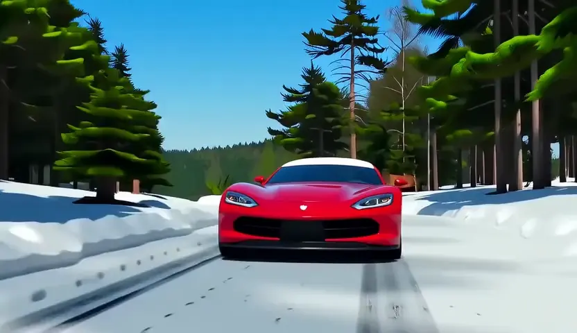
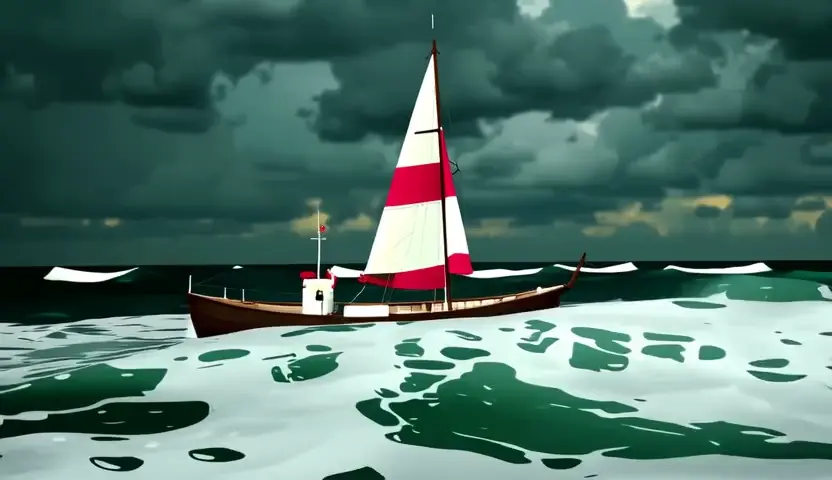

This is experimental, video quality is not ideal and negative prompt following is not as good as SD-3.5.
The support of Wan 2.1 is thanks to @MeiYi-dev's suggestion of [CausVid LoRA](https://huggingface.co/Kijai/WanVideo_comfy/blob/main/Wan21_CausVid_bidirect2_T2V_1_3B_lora_rank32.safetensors).  

We are looking for CFG-free video generation that can work in HuggingFace Diffusers, this current LoRA cannot provide the best quality. 

Known Issues:
- The video will has a few frames at the begining that has very high contrast. Could be related to https://github.com/Wan-Video/Wan2.1/issues/369.
- 

Video compressed when export. All videos are generated with fixed seed 42.

**Positive Prompt:** A chef cat and a chef dog with chef suit baking a cake together in a kitchen. The cat is carefully measuring flour, while the dog is stirring the batter with a wooden spoon.  
**Negative Prompt:** white dog

| Original | VSF |
|----------|-----|
|  |  |

---

**Positive Prompt:** A cessna flying over a snowy mountain landscape, with a clear blue sky and fluffy white clouds. The plane is flying at a low altitude, casting a shadow on the snow-covered ground below. The mountains are rugged and steep, with patches of evergreen trees visible in the foreground.  
**Negative Prompt:** trees

| Original | VSF |
|----------|-----|
|  |  |

---

**Positive Prompt:** A cessna flying over a snowy mountain landscape, with a clear blue sky and fluffy white clouds. The plane is flying at a low altitude, casting a shadow on the snow-covered ground below.  
**Negative Prompt:** plane wings

| Original | VSF |
|----------|-----|
|  |  |

---

**Positive Prompt:** a car driving through a snowy forest, the car is a red sports car with snow on the roof, the trees are tall and covered in snow. The sky is clear and blue  
**Negative Prompt:** tire tread mark

| Original | VSF |
|----------|-----|
|  |  |

---

**Positive Prompt:** a boat in a stormy sea, the boat is a small fishing boat with a red and white striped sail, the waves are high and crashing against the boat, the sky is dark and cloudy  
**Negative Prompt:** sail

| Original | VSF |
|----------|-----|
|  |  |

---

**Positive Prompt:** a cat running in the field, the cat is wearing a red scarf and a blue hat, the field is full of flowers and the sky is clear  
**Negative Prompt:** camera motion

| Original | VSF |
|----------|-----|
|  |  |

---
**Positive Prompt:** A stream of molten lava pouring from a large industrial metal tube onto a cracked, scorched floor, surrounded by rising smoke and heat distortion, dark background with minimal lighting  

**Negative Prompt:** red hot, glowing

| Original | VSF |
|----------|-----|
|  |  |

---
**Positive Prompt:** A camouflaged crab blends into the rocky, sandy seafloor, matching its surroundings perfectly in texture, color, and shape, making it very hard to distinguish from the background. The crab moves subtly across the substrate, with its motion barely noticeable and its body consistently mimicking the appearance of rocks and sand clusters.

**Negative Prompt:** the animal is easy to see. It is clearly visible, standing out, different than the background

| Original | VSF |
|----------|-----|
|  |  |

---
**Positive Prompt:** A flatfish camouflaged against a sandy seabed, blending in perfectly through texture, color, and shape. The animal is hard to distinguish as it subtly shifts and moves, almost invisible to the untrained eye due to its sophisticated camouflage.

**Negative Prompt:** the animal is easy to see. It is clearly visible, standing out, different than the background

| Original | VSF |
|----------|-----|
|  |  |

